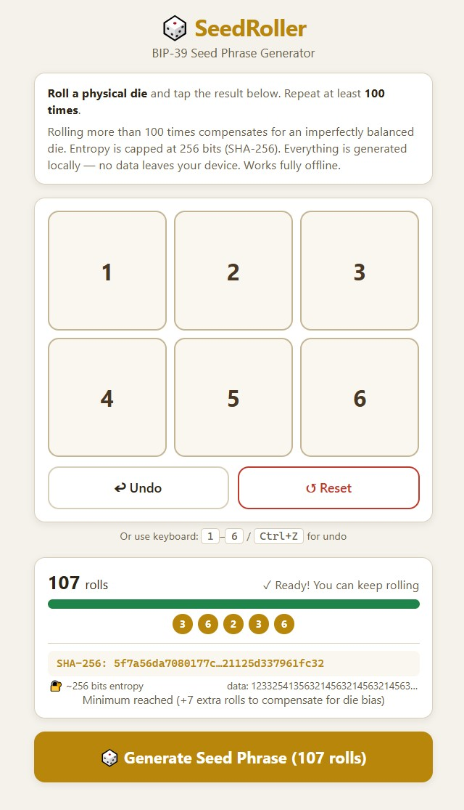
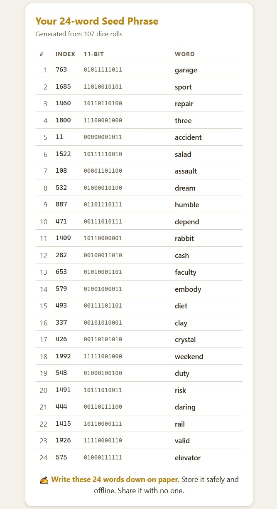

# 🎲 SeedRoller — BIP-39 Seed Phrase Generator

**Generate a cryptographically sound 24-word seed phrase using a physical six-sided die.**  
No network, no dependencies, no tracking. One self-contained HTML file.

## Why?

Hardware wallets and software wallets generate seed phrases using built-in RNGs you cannot verify. SeedRoller lets you **supply your own entropy** by rolling a physical die — transparent, auditable, and trustless.

## How it works

1. **Roll a physical D6** and tap the result (or press `1`–`6` on your keyboard)
2. **Repeat at least 100 times** — extra rolls compensate for any die bias
3. All roll data is concatenated and hashed with **SHA-256**
4. The 256-bit hash is split into 24 groups of 11 bits → each group maps to a BIP-39 word
5. A checksum byte (first byte of SHA-256²) is appended for the final word

**Everything happens locally in your browser. No data ever leaves your device.**

## Secure offline usage

> ⚠️ **Critical:** The device you use to generate your seed phrase should **never connect to the internet again** after generating the seed. Malware that is already on the device could have logged your screen, keystrokes, or clipboard and may transmit them the moment the device comes back online. Use a device you are willing to keep permanently offline, or factory-reset it afterward.

### On a laptop (recommended)

1. On an **online computer**, download `SeedRoller.html` from this repository
2. Copy the file onto a **USB stick**
3. **Eject** the USB stick safely
4. On a **separate laptop** that is already **disconnected from the internet** (Wi-Fi off, Ethernet unplugged, airplane mode):
   - Plug in the USB stick and open the HTML file in any modern browser
5. Roll your physical die, tap the results, generate your seed phrase
6. **Write the 24 words on paper** — never type them, never photograph them, never store them digitally
7. Close the browser, remove the USB stick
8. **Keep this laptop offline permanently**, or perform a full factory reset / wipe the hard drive before reconnecting it to any network

### On a smartphone

1. **Download** `SeedRoller.html` to your phone (via cable, SD card, or download it first, then go offline)
2. **Enable airplane mode** ✈️ — turn off Wi-Fi, Bluetooth, and mobile data
3. Open the file with your browser (e.g., `file:///.../SeedRoller.html`)
4. Roll, tap, generate
5. **Write the 24 words on paper**
6. Delete the file from your phone
7. **Keep the phone offline permanently**, or perform a full factory reset before reconnecting

> ⚠️ **Smartphones are higher risk** than air-gapped laptops. Modern phones run many background services and are harder to verify as truly offline. A factory reset is strongly recommended if you must bring the phone back online afterward.

## Verifying the file

You can verify the HTML file hasn't been tampered with by opening it in a text editor. The entire logic is readable JavaScript — no minified code, no external requests, no obfuscation.

## Technical details

| Property | Value |
|---|---|
| Wordlist | BIP-39 English (2048 words) |
| Entropy source | User-supplied D6 dice rolls |
| Hashing | SHA-256 (Web Crypto API) |
| Checksum | SHA-256² (first byte) |
| Output | 24-word mnemonic (256-bit entropy) |
| Dependencies | None |
| Network requests | 0 |
| File size | ~60 KB |

## Entropy transparency

During rolling, a **live entropy panel** shows:
- The truncated SHA-256 hash of your roll data so far
- Estimated raw entropy collected (~2.58 bits per D6 roll, capped at 256)
- A **gold flash** animation on the hash every time it changes — demonstrating the avalanche effect: one new roll completely transforms the hash

This gives you real-time confidence that every roll is contributing to the final seed.

## Screenshots

### Rolling interface

### Generated seed phrase

## Languages

- `SeedRoller.html` — English

## License

MIT — do what you want. Verify the code yourself.
